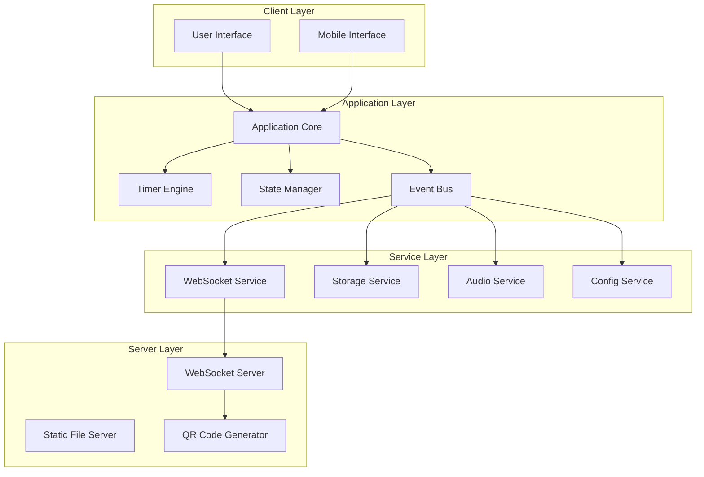

# Design Document

## Overview

Данный документ описывает архитектурное решение для полной переработки CrossFit Timer - веб-приложения для спортивных тренировок. Новая архитектура основана на современных принципах модульного дизайна, обеспечивает высокую производительность, масштабируемость и отличный пользовательский опыт на всех устройствах.

## Architecture

### High-Level Architecture



### Core Principles

1. **Модульность** - четкое разделение ответственности между компонентами
2. **Реактивность** - использование событийной архитектуры для синхронизации состояния
3. **Расширяемость** - возможность добавления новых типов таймеров без изменения существующего кода
4. **Отказоустойчивость** - graceful degradation при потере соединения или ошибках
5. **Производительность** - оптимизация для работы в реальном времени

## Components and Interfaces

### Frontend Components

#### 1. Application Core (`App`)
Центральный компонент приложения, координирующий работу всех модулей.

```typescript
interface IApp {
  initialize(): Promise<void>;
  navigate(screen: string, params?: any): void;
  getCurrentState(): AppState;
  destroy(): void;
}

interface AppState {
  currentScreen: string;
  activeTimer: TimerType | null;
  isConnected: boolean;
  settings: UserSettings;
}
```

#### 2. Timer Engine (`TimerEngine`)
Ядро для управления различными типами таймеров.

```typescript
interface ITimerEngine {
  createTimer(type: TimerType, config: TimerConfig): ITimer;
  getActiveTimer(): ITimer | null;
  destroyTimer(id: string): void;
}

interface ITimer {
  id: string;
  type: TimerType;
  state: TimerState;
  start(): void;
  pause(): void;
  reset(): void;
  getTimeRemaining(): number;
  getCurrentPhase(): TimerPhase;
  onTick(callback: (state: TimerState) => void): void;
  onPhaseChange(callback: (phase: TimerPhase) => void): void;
  onComplete(callback: () => void): void;
}

enum TimerType {
  INTERVAL = 'interval',
  FOR_TIME = 'for_time',
  AMRAP = 'amrap',
  CLOCK = 'clock'
}

enum TimerPhase {
  COUNTDOWN = 'countdown',
  WORK = 'work',
  REST = 'rest',
  FINISHED = 'finished'
}
```

#### 3. State Manager (`StateManager`)
Управление глобальным состоянием приложения с поддержкой синхронизации.

```typescript
interface IStateManager {
  getState(): AppState;
  setState(updates: Partial<AppState>): void;
  subscribe(callback: (state: AppState) => void): () => void;
  syncWithRemote(remoteState: Partial<AppState>): void;
}
```

#### 4. Event Bus (`EventBus`)
Система событий для слабосвязанного взаимодействия компонентов.

```typescript
interface IEventBus {
  emit(event: string, data?: any): void;
  on(event: string, callback: (data: any) => void): () => void;
  once(event: string, callback: (data: any) => void): void;
  off(event: string, callback?: (data: any) => void): void;
}

// Основные события
enum AppEvents {
  TIMER_START = 'timer:start',
  TIMER_PAUSE = 'timer:pause',
  TIMER_RESET = 'timer:reset',
  TIMER_TICK = 'timer:tick',
  TIMER_PHASE_CHANGE = 'timer:phase_change',
  TIMER_COMPLETE = 'timer:complete',
  SCREEN_CHANGE = 'screen:change',
  SETTINGS_UPDATE = 'settings:update',
  CONNECTION_STATUS = 'connection:status'
}
```

### Service Layer

#### 1. WebSocket Service (`WebSocketService`)
Управление WebSocket соединениями для удаленного управления.

```typescript
interface IWebSocketService {
  connect(): Promise<void>;
  disconnect(): void;
  send(message: WebSocketMessage): void;
  onMessage(callback: (message: WebSocketMessage) => void): () => void;
  isConnected(): boolean;
  getConnectionId(): string;
}

interface WebSocketMessage {
  type: MessageType;
  payload: any;
  timestamp: number;
  senderId?: string;
}

enum MessageType {
  INIT = 'init',
  STATE_SYNC = 'state_sync',
  COMMAND = 'command',
  QR_REQUEST = 'qr_request',
  CONTROL_TAKEN_OVER = 'control_taken_over',
  HEARTBEAT = 'heartbeat'
}
```

#### 2. Storage Service (`StorageService`)
Управление локальным хранилищем настроек и состояния.

```typescript
interface IStorageService {
  save<T>(key: string, data: T): Promise<void>;
  load<T>(key: string): Promise<T | null>;
  remove(key: string): Promise<void>;
  clear(): Promise<void>;
  isAvailable(): boolean;
}

// Ключи для хранения
enum StorageKeys {
  USER_SETTINGS = 'user_settings',
  TIMER_PRESETS = 'timer_presets',
  LAST_SESSION = 'last_session'
}
```

#### 3. Audio Service (`AudioService`)
Управление звуковыми сигналами и настройками аудио.

```typescript
interface IAudioService {
  playSound(soundType: SoundType): Promise<void>;
  setVolume(volume: number): void;
  getVolume(): number;
  setSoundPack(pack: SoundPack): void;
  isEnabled(): boolean;
  setEnabled(enabled: boolean): void;
}

enum SoundType {
  BEEP = 'beep',
  START = 'start',
  REST = 'rest',
  FINISH = 'finish'
}

enum SoundPack {
  CLASSIC = 'classic',
  SHARP = 'sharp',
  SOFT = 'soft'
}
```

#### 4. Config Service (`ConfigService`)
Управление конфигурацией приложения и готовыми схемами тренировок.

```typescript
interface IConfigService {
  getPresets(): TimerPreset[];
  getPreset(id: string): TimerPreset | null;
  // Методы для пользовательских пресетов (MVP: заглушки)
  addCustomPreset(preset: TimerPreset): void;
  removeCustomPreset(id: string): void;
  getAppConfig(): AppConfig;
}

interface TimerPreset {
  id: string;
  name: string;
  type: TimerType;
  config: TimerConfig;
  isCustom: boolean;
}

interface AppConfig {
  defaultSettings: UserSettings;
  supportedLanguages: string[];
  maxConnections: number;
  heartbeatInterval: number;
}
```

### UI Components

#### 1. Screen Components
Каждый экран представлен отдельным компонентом с четким интерфейсом.

```typescript
interface IScreen {
  render(): HTMLElement;
  mount(container: HTMLElement): void;
  unmount(): void;
  onEnter(): void;
  onExit(): void;
  handleKeyboard(event: KeyboardEvent): boolean;
}

// Основные экраны
class MainMenuScreen implements IScreen { }
class TimerSetupScreen implements IScreen { }
class TimerRunningScreen implements IScreen { 
  // Инкапсулирует сложную логику отображения:
  // - прогресс-бар по границе экрана
  // - графики-бублики для раундов/кругов
  // - визуальные индикаторы фаз
  // Слушает события TIMER_TICK и TIMER_PHASE_CHANGE от EventBus
}
class ClockScreen implements IScreen { }
class SettingsScreen implements IScreen { }
```

#### 2. Timer Components
Специализированные компоненты для каждого типа таймера.

```typescript
abstract class BaseTimer implements ITimer {
  protected config: TimerConfig;
  protected state: TimerState;
  protected eventBus: IEventBus;
  
  abstract start(): void;
  abstract pause(): void;
  abstract reset(): void;
  abstract update(): void;
}

class IntervalTimer extends BaseTimer { }
class ForTimeTimer extends BaseTimer { }
class AmrapTimer extends BaseTimer { }
class ClockTimer extends BaseTimer { }
```

## Data Models

### Timer Configuration

```typescript
interface TimerConfig {
  // Общие настройки
  countdownSeconds: number;
  
  // Интервальный таймер
  cycles?: number;  // Количество кругов (1 круг = заданное количество раундов)
  rounds?: number;  // Количество раундов в круге
  workMinutes?: number;
  workSeconds?: number;
  restMinutes?: number;
  restSeconds?: number;
  
  // На время / AMRAP
  targetMinutes?: number;
  targetSeconds?: number;
}

interface TimerState {
  isRunning: boolean;
  isPaused: boolean;
  currentPhase: TimerPhase;
  timeRemaining: number;
  currentRound?: number;
  totalRounds?: number;
  elapsedTime: number;
}
```

### User Settings

```typescript
interface UserSettings {
  audio: AudioSettings;
  display: DisplaySettings;
  controls: ControlSettings;
}

interface AudioSettings {
  enabled: boolean;
  volume: number;
  soundPack: SoundPack;
}

interface DisplaySettings {
  theme: 'dark' | 'light';
  fontSize: 'small' | 'medium' | 'large';
  showProgress: boolean;
}

interface ControlSettings {
  keyboardShortcuts: boolean;
  clickToToggle: boolean;
  autoFullscreen: boolean;
}
```

## Error Handling

### Error Types

```typescript
enum ErrorType {
  NETWORK_ERROR = 'network_error',
  STORAGE_ERROR = 'storage_error',
  AUDIO_ERROR = 'audio_error',
  TIMER_ERROR = 'timer_error',
  VALIDATION_ERROR = 'validation_error'
}

interface AppError {
  type: ErrorType;
  message: string;
  details?: any;
  timestamp: number;
  recoverable: boolean;
}
```

### Error Handling Strategy

1. **Graceful Degradation** - приложение продолжает работать при частичных сбоях
2. **User Feedback** - понятные сообщения об ошибках для пользователя
3. **Automatic Recovery** - автоматическое восстановление соединений и состояния
4. **Fallback Modes** - резервные режимы работы (например, без звука или без синхронизации)

### Error Recovery

```typescript
interface IErrorHandler {
  handleError(error: AppError): void;
  canRecover(error: AppError): boolean;
  attemptRecovery(error: AppError): Promise<boolean>;
  notifyUser(error: AppError): void;
}
```

## Testing Strategy

### Unit Testing
- Тестирование каждого компонента изолированно
- Моки для внешних зависимостей
- Покрытие критических путей выполнения

### Integration Testing
- Тестирование взаимодействия компонентов
- WebSocket соединения и синхронизация
- Сохранение и восстановление состояния

### End-to-End Testing
- Полные пользовательские сценарии
- Кроссбраузерное тестирование
- Мобильные устройства и адаптивность

### Performance Testing
- Точность таймеров
- Производительность при длительной работе
- Нагрузочное тестирование WebSocket соединений

## Security Considerations

### Client-Side Security
- Валидация всех пользовательских вводов
- Защита от XSS атак
- Безопасное хранение настроек

### WebSocket Security
- Валидация origin для WebSocket соединений
- Ограничение количества подключений
- Защита от DoS атак

### Data Privacy
- Минимизация сбора данных
- Локальное хранение настроек
- Отсутствие персональных данных на сервере

## Performance Optimization

### Frontend Optimization
- Ленивая загрузка компонентов
- Виртуализация DOM для больших списков
- Оптимизация перерисовки таймера
- Кэширование статических ресурсов

### Timer Precision
- Использование `performance.now()` для точных измерений
- Компенсация drift в JavaScript таймерах
- Оптимизация частоты обновления

### Memory Management
- Правильная очистка event listeners
- Управление жизненным циклом компонентов
- Предотвращение утечек памяти в WebSocket

### Network Optimization
- Минимизация WebSocket сообщений
- Сжатие данных при передаче
- Оптимизация reconnection логики